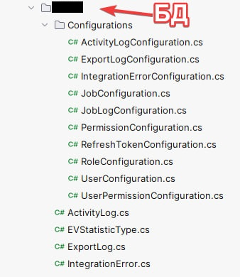
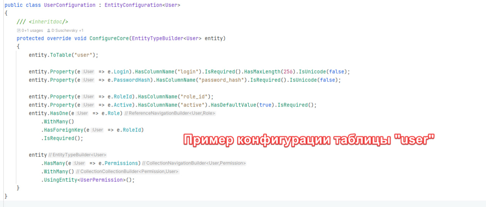
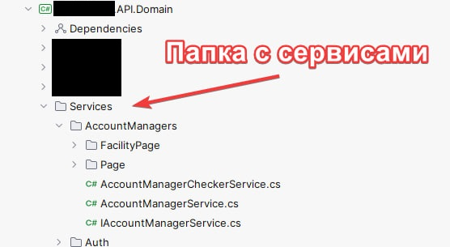
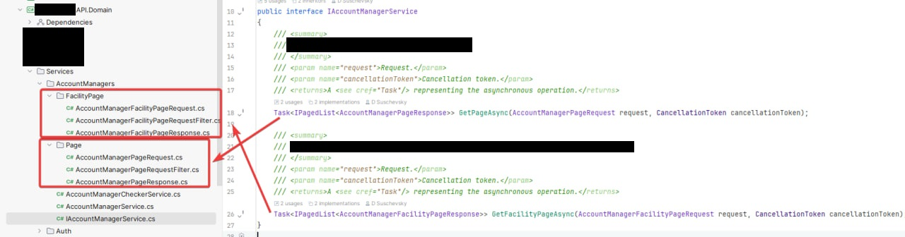

# Детали по написанию и оформлению кода

## Архитектура и структура проекта

- **Сервисы (Domain Layer)**: логика обработки данных, взаимодействие с EF Core
- **Инфраструктура (Infrastructure Layer)**: Специфичные реализации (например, работа с CSV, отпрвка почты)
- **Компоненты Blazor (UI Layer)**: использование DI для взаимодействия с сервисами
- **Авторизация**: через `AuthorizeView`, `AuthenticationStateProvider` и `[Authorize(Roles = "...")]`

Нигде напрямую не должны использоаться свойства DateTime.Now и/или DateTime.UtcNow, используется только ISystemClock для дальнейшего тестирования.

В проекте используем SmartEnum. Все enum начинаются с префикса EV = EnumValue, а все SmartEnum с префикса SE = SmartEnum соответсвенно. Это потом упростит работу. Часто полезно в тех же API, да и других проектах, как правило для enum нужны доп детали, описание, код или ещё что-то, тогда и используется SmartEnum.

Пример структуры проекта для конфигурации БД. Папка для бд, там модели, а в ней есть папка Configurations, там конфигурации моделей для БД (в папке могут быть не только сущности для БД, но и необходимые ValueObjects). В примере с конфигурацией наследование идёт от кастомного класса, который наследуется в итоге от IEntityTypeConfiguration<T>.

Пример структуры в Domain. Папка со всеми сервисами, каждая подпапка = Сервис и всё что с ним связанно. Интерфейс (если он нужен), реализация и папки для методов. Структуру нужно соблюдать, потом будет проще ориентироваться в коде

---

## **Оформление кода**

Для автоматического форматирования кода запускаем команду `dotnet format`. Данная команда может исправить не все ошибки (например документирование она не исправит), остальное нужно поправить руками при необходимости.

---

## База данных

> Для всех операций используется Entity Framework Core. Предполагается использование миграций

### **Общие сведения по сущностям**

Во всех моделях должны быть CreatedAt & UpdatedAt & Id, если это не M-M (генерируемая EF, если мы добавляем кастомные колонки вроде Active, дату создания и обновления нужно добавить). CreatedAt & UpdatedAt заполняются автоматически во время вызова SaveChanges. Можно реализовать подписавшись на событие SavingChanges.

### **Миграции**

Обязательно делается отдельным проектом.

---

## **Тестирование**

При добавление *ЛЮБОГО* функционала (кроме `UI`, его тестировать не будем, хотя там тоже часто возникают ошибки), должны быть написаны тесты, которые проверяют работоспособность кода. При тестировании сервисов, необходимо использовать EF Core + Sqlite в InMemory режиме, использование просто InMemory провайдер не проверит корректность Linq Expression.

Тестируем придерживаясь [AAA](https://habr.com/ru/articles/169381/).

---

## **Git**

### **Коммиты**

Шаблон сообщения коммитов следующий: `PROJECT, AREA: ACTION`

Т.е, например, был добавлен сервис UserService в проект Domain, тогда сообщение будет такое `Domain, UserService: Added service`. Если в сервис был добавлен метод `CreateUserAsync`, тогда сообщение будет такое `Domain, UserService: Added 'CreateUserAsync' method`. Если добавляются тесты для сервиса `Test, UserService: Added tests for service` и т.д. Если что-то глобальное по проекту было сделано `Project`, но в идеале таких коммитов не должно быть, если за 1 коммит нельзя однозначно описать что было сделано, скорее всего делается что-то не так и в рамках одного коммита было сделано слишком много изменений.

### **Именование веток**

Каждая ветка должна начинатся с префикса `feature` или `bug`, а далее идёт номер задачи. 

Пример, есть задача `https://github.com/blowin/LMS.System/issues/2`, у неё номер `2`, если мы делаем ветку для этой задачи, то название ветки будет такое: `feature/#2`, если это `bug`, то: `bug/#2`.

В названии PR обязательно должен фигурировать номер задачи, а так же она должна быть слинкована с PR (см поле `Development` в PR).
